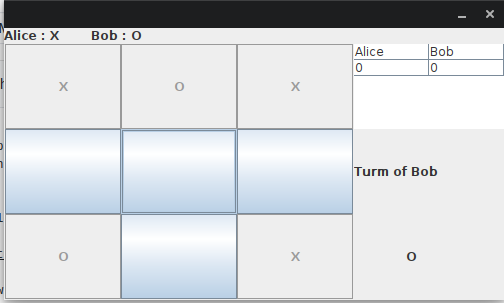

# JAVA-TIC-TAC-TOE
Tic-tac-toe a simple paper-and-pencil game for two player's, noughts and crosses, or Xs and Os, who take turns marking the spaces in a 3×3 grid. The player who succeeds in placing three of their marks in a horizontal, vertical, or diagonal row is the winner.

Using:
1. Clone the repo in local machine or download repo as Zip on local machine & extract it

    <code>git clone https://github.com/himanshusandha/JAVA-TIC-TAC-TOE.git</code>
  
2. Traverse to the newly added folder of repo & Open CLI for the folder.

3. Run the command:
  
   <code>java Start</code>
   
Yooo!!!! It's done, enjoy playing Tic-Tac-Toe with your friends

<b>Setting Player's name</b> 

<b>Gameplay screen</b> 

<b>Result</b> 

<b>Final winner</b> 

